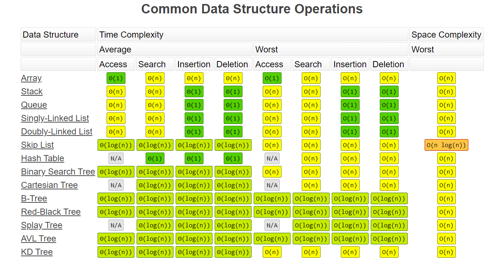

## Asymptotic notation, Big-O Notation
***Asymptotic Notations** are languages that allow us to analyze an algorithm's running time by identifying its behavior as the input size for the algorithm increases.

**Graph - 1**

**Graph - 2**

**Graph - 3**

## Note: All Examples are based on Time Complexity But Rules applied for Time and Space both complexity
### Rules to calculate BIG O(n)

###### *Rule: 1*
_`while calculating BIG-O we always consider the worst case scenario.`_
###### *Rule: 2*
_`while calculating BIG-O we always remove Constants(like: BIG O(1), 2n=>n, n/2=>n, n+1 or n+100=>n, n-1 or n-100=>n) case scenario. Meaning whatever constans are in multiplication, dividision, add, substraction with 'n' doesn't matter because we are talking about millions of unknown inputs during runtime so that time these constants effects becomes negligible.`_
###### *Rule: 3*
_`while calculating BIG-O, if multiple different inputs are there to that function for Ex:`_

Ex1:

    function f1(input1, input2){
        input1.forEach(function(input1){  //O(n) or O(a)
            console.log(input1);
        });
        input1.forEach(function(input1){ //O(n) or O(a)
            console.log(input1);
        });
    }

`BIG O(n+n) or O(a+a) => BIG O(2n) => BIG O(n)`

Note:- *Because here operation is happened on same input i.e. 'input1'*

Ex2:

    function f1(input1, input2){
        input1.forEach(function(input1){ //O(n) or (a)
            console.log(input1);
        });
        input2.forEach(function(input1){ // O(m) or O(b)
            console.log(input1);
        });
    }

`BIG O(n+m) or O(a+b) => BIG O(n+m) or O(a+b)`

Note:- *Because here operation is happened on different inputs i.e. 'input1 & input2'*

Ex3: For BIG O(n^2)

    function f1(input){
        input.forEach(function(input){ //O(n) or (a)
            input.forEach(function(input){ // O(m) or O(b)
                console.log(input);
            });
        });
    }

`BIG O(n*n) or O(a*a) => BIG O(n^2) or O(a^2)`

Note: For nested Operations, inputs always multiplies. so its comes under Quadratic operation, if no of nested operations 3 then it comes under cubic operation and so on.... 
###### *Rule: 4*
_`while calculating BIG-O we always consider worst case scenario.`_

###### *BIG O cheat sheet*
**-Big Os-**

1. O(1) Constant- no loops
2. O(log N) Logarithmic- usually searching algorithms have log n if they are sorted (Binary Search)
3. O(n) Linear- for loops, while loops through n items ( single loop no nested loops)
4. O(n log(n)) Log Linear- usually sorting operations
5. O(n^2) Quadratic- every element in a collection needs to be compared to ever other element. Two nested loops.
6. O(2^n) Exponential- recursive algorithms that solves a problem of size N
7. O(n!) Factorial- you are adding a loop for every element
8. Iterating through half a collection is still O(n)
9. Two separate collections: O(a * b)

***O(n!) - most expensive one If you are getting this notation for your function then most probably you are doing something wrong. This is the most rarely used notation for any DS for EX:*** 

    void nFacRuntimeFunc(int n) {
        for(int i=0; i<n; i++) {
            nFacRuntimeFunc(n-1);
        }
    }
Note: Here we can say that this operation will run for ***n factorial*** times. 
Factorial means:- Factorial of 5, `5! = 1*2*3*4*5 = 120` and `0!=1` Rule is `n! = n × (n−1)!`

**-What can cause time in a function?-**

1. Operations (+, -, *, /)
2. Comparisons (<, >, ==)
3. Looping (for, while)
4. Outside Function call (function())

**-Rule Book-**

1. Rule 1: Always the worst Case
2. Rule 2: Remove Constants
3. Rule 3: Different inputs should have different variables. O(a+b). A and B arrays nested would be
O(a*b)
    + Addition for steps in order
    + Multiplication for nested steps 
4. Rule 4: Drop Non-dominant terms

**-What causes Space complexity?-**

1. Variables
2. Data Structures (Arrays, hashMap...)
3. Function Call
4. Allocations

####What About "0!"
Zero Factorial is interesting ... it is generally agreed that 0! = 1.

It may seem funny that multiplying no numbers together results in 1, but let's follow the pattern backwards from, say, 4! like this:
24/4=6, 6/3=2, 2/2=1, 1/1=1

And in many equations using 0! = 1 just makes sense.

# Space complexity
### Space complexity O(1)
    function boooo(n) {
        for (let i = 0; i < n; i++) {
            console.log('booooo');
        }
    }
    boooo(6);
Here `let i=0` takes 1 space i.e. O(1)
### Space complexity O(n)
    function arrayOfHiNTimes(n) {
        var hiArray = [];
        for (let i = 0; i < n; i++) {
            hiArray[i] = 'hi'; // O(n)
        }
        return hiArray;
    }

    arrayOfHiNTimes(6)
Here `let i=0` takes 1 space i.e O(1) but datastructure Array is **_getting assign some value at all n numbers of indexes_** that's why O(n). So its space complexity will be BIG O(n)

## Common Data Structure Operations

### Array Sorting Algorithms

Reference: https://www.bigocheatsheet.com/

helllo